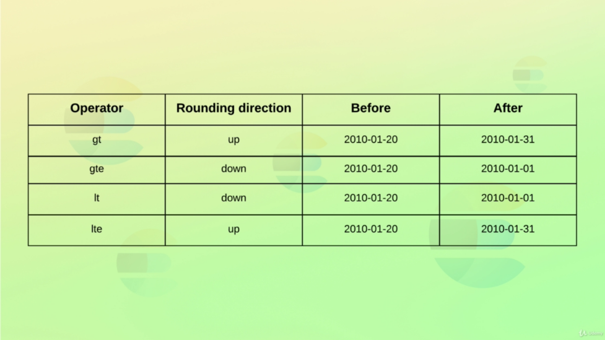

# Term Level Queries

Term Level Queries usually is used to query date, boolean, keywords fields and numeric fields since it searches for **exact match**.

- `Searching by One Term`

```bash
# GET /<index>/_search
# "{ "query": { "term": { "<field>" : "value" } } }"

GET /products/_search
{
  "query": {
    "term" : {
      "is_active": "true"
    }
  }
}

# OR

GET /products/_search
{
  "query": {
    "term" : {
      "is_active": {
        "value" : true
      }
    }
  }
}
```

- `Searching by Multiple Terms`

```bash
# GET /<index>/_search
# "{ "query": { "terms": { "<field>" : ["value1", "value2"] } } }"

GET /products/_search
{
  "query": {
    "terms": {
      "tags.keyword": [
        "Soup",
        "Cake"
      ]
    }
  }
}
```

- `Searching by IDs`
```bash
# GET /<index>/_search
# { "query": { "ids": { "values": [ <ids> ] } } }

GET /products/_search
{
  "query": {
    "ids": {
      "values": [1,2,3]
    }
  }
}
```

- `Searching by Range`
```bash
# GET /<index>/_search
# {"query": { "range": { "<field>": { "...conditions" }}}}

# Numbers
GET /products/_search
{
  "query": {
    "range": {
      "in_stock": {
        "gte": 1,
        "lte": 5
      }
    }
  }
}

# Dates
GET /products/_search
{
  "query": {
    "range": {
      "created": {
        "gte": "01-01-2010",
        "lte": "31-12-2010",
        "format": "dd-MM-yyy"
      }
    }
  }
}
```

- `Using Date Math`
```bash
GET /products/_search
{
  "query": {
    "range": {
      "created": {
        "gte": "2010/01/01||-1y-1d", #subtracts 1 year and 1 day from anchor date 
        "lte": "now-10y" # subtracts 10years from currently date
      }
    }
  }
}
```

- `Using Date Math Rounding`
```bash
GET /products/_search
{
  "query": {
    "range": {
      "created": {
        "gte": "2010/01/20||/d", # Rounds to 2010/01/01
        "lte": "2020/01/20||/d"  # Rounds to 2020/01/31
      }
    }
  }
}
```

- `Date Math Rounding Logic`



- `Searching Non Null Fields`
```bash
# GET /<index>/_search
# {"query": { "exists": { "<field>": "<field-name>" }}}

# This works just with values `null` or `[]`, Empty Strings such: `""` or `"-"` is not null
GET /products/_search
{
  "query": {
    "exists": {
      "field": "tags"
    }
  }
}
```

- `Searching by Prefix`
```bash
# GET /<index>/_search
# { "query": { "prefix": { "<field>" : "<value>" }}}

GET /products/_search
{
  "query": {
    "prefix": {
      "tags.keyword": "Veg" # (prefix of Vegetable)
    }
  }
}
```

- `Searching with Wildcards` - (Could result in a slow query! )

There are two types of wildcards:

`"*"` - Matches zero or more characters

`"?"` - Matches one character

```bash
# GET /<index>/_search
# { "query": { "wildcard": { "<field>" : "<value>" }}}

# Example with `*` wildcard
GET /products/_search
{
  "query": {
    "wildcard": {
      "tags.keyword": "Veg*ble"
    }
  }
}

#OR
# Example with `?` wildcard
GET /products/_search
{
  "query": {
    "wildcard": {
      "tags.keyword": "Veget?ble"
    }
  }
}
```


- `Searching with Regex` - (Could result in a slow query! )

```bash
# GET /<index>/_search
# { "query": { "regexp": { "<field>" : "<regex-value>" }}}

GET /products/_search
{
  "query": {
    "regexp": {
      "tags.keyword": "Veg[a-zA-z]+le"
    }
  }
}

```

## Utils
---

- [Term-level Queries](https://www.elastic.co/guide/en/elasticsearch/reference/current/term-level-queries.html)

- [Date Math](https://www.elastic.co/guide/en/elasticsearch/reference/current/common-options.html#date-math)

- [Regular Expresssion Syntax](https://www.elastic.co/guide/en/elasticsearch/reference/current/regexp-syntax.html)