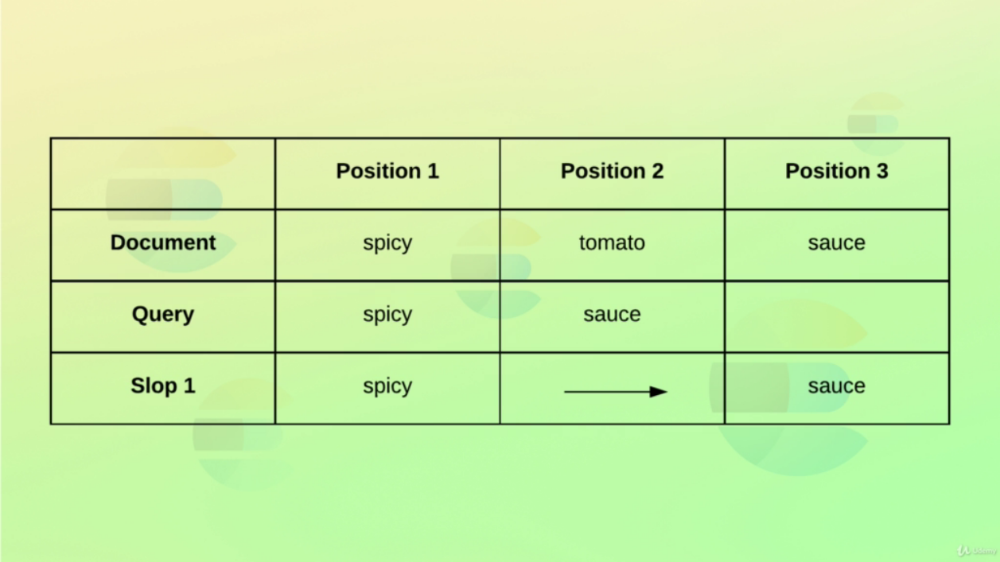
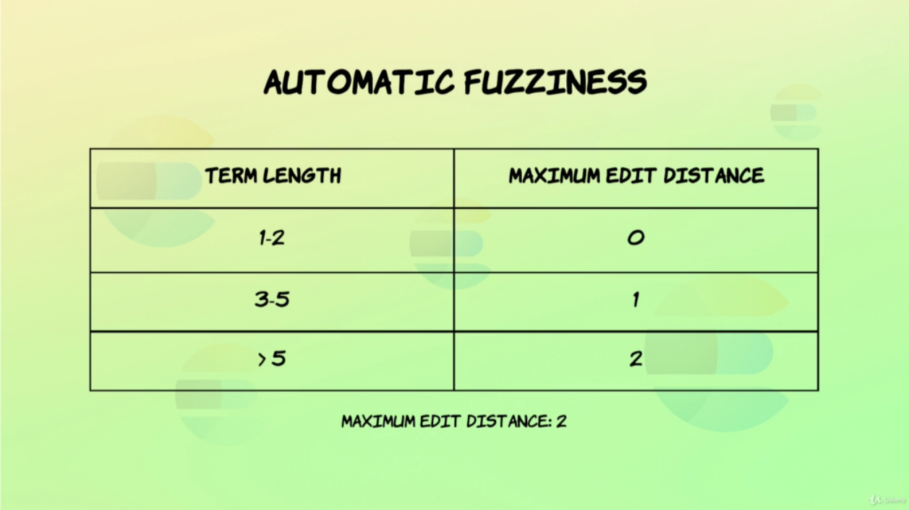

# Full Text Queries

Full Text Queries or Match Queries are used to query text or portions of text in fields (blog post, articles, description etc. ) **not exact match**. For that reason it is necessary to calculate relevance score to present good results.

- `Matching Terms`

The default operator in a match query is `OR` so, not all terms could be in the result. (Of course, if a result have all terms it will be in the result set, and also will have a bigger relevance score)

```bash
# GET /<index>/_search
# "{ "query": { "match": { "<field>" : "value" } } }"

GET /recipe/_search
{
  "query": {
    "match": {
      "title": "Recipes with pasta or spaghetti"
    }
  }
}
```

However, it is possible to change de default behavior of the match query, obliging are terms to be present in the result. In other words, the result must have all searched terms (operator `AND`).

```bash
# GET /<index>/_search
# "{ "query": { "match": { "<field>" : "value" } } }"

GET /recipe/_search
{
  "query": {
    "match": {
      "title": {
        "query": "pasta spaghetti",
        "operator": "and"
      }
    }
  }
}
```

- `Matching Phrases` (Terms Order)

Allows to match terms in specific order

```bash
# GET /<index>/_search
# { "query": { "match_phrase": { "<field>": "<value>" }}}

GET /recipe/_search
{
  "query": {
    "match_phrase": {
      "title": "spaghetti puttanesca"
    }
  }
}
```

- `Matching Terms in Multiple Fields`
```bash
# GET /<index>/_search
# { "query": { "multi_match": { "query": "<value>", "fields": ["<field1>", "<field2>"] }}}

GET /recipe/_search
{
  "query": {
    "multi_match": {
      "query": "pasta",
      "fields": ["title", "description"]
    }
  }
}
```

- `Allows Terms Between the searched phase (slop)`
```bash
# GET /<index>/_search
# { "query": { "match_phrase": { "<field>": { "query": "<value>", "slop": <number> }}}}

PUT /proximity/_doc/1
{
  "title": "Spicy Sauce"
}

PUT /proximity/_doc/2
{
  "title": "Spicy Tomato Sauce"
}

PUT /proximity/_doc/3
{
  "title": "Spicy Tomato and Garlic Sauce"
}


GET /proximity/_search
{
  "query": {
    "match_phrase": {
      "title": {
        "query": "spicy sauce",
        # Allows this quantity of terms to be between the search phase, this ways _doc 1 and 2 will be a match
        "slop": 1
      }
    }
  }
}
```


- `Fuzziness (Handling Typos)`

Allows Elasticsearch to correct typos in the input of the search

```bash
# GET /<index>/_search
# "{ "query": { "match": { "<field>" : { "query": "<value>", fuzziness: "auto|number" }}}}"

GET /recipe/_search
{
  "query": {
    "match": {
      "title": {
        "query": "l0bster",
        "fuzziness": "auto"
      }
    }
  }
}
``` 


## Utils
---

- [Multi Match Queries](https://www.elastic.co/guide/en/elasticsearch/reference/current/query-dsl-multi-match-query.html)
