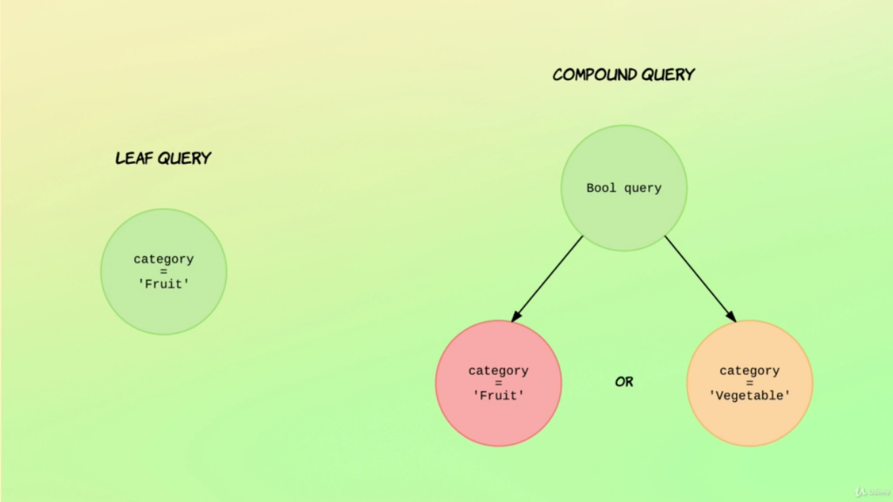

# CompoundQueries - Boolean Logic

Compound Queries are complex queries that permoforms two or more operation, in other words, they have a boolean logic.



- `Bool Operations`

```bash
# GET /<index>/_search
# { "query": { "bool": { <operators...> } }}
GET /recipe/_search
{
  "query": {
    "bool": {
      # Clause must Appear in matching documents and will contribute to the score
      "must": [
        {
          "match": {
            "ingredients.name": "parmesan"
          }
        }
      ],
      # Clause should not appear in matching documents.
      "must_not": [
        {
          "match": {
            "ingredients.name": "tuna"
          }
        }
      ],
      # Clause should appear in matching document, if `must option` is used the `should option` is like a boost for the score
      "should": [
        {
          "match": {
            "ingredients.name": "parsley"
          }
        }
      ],
      # Clause mulst appear in the matching documents, however the score will be ignored. (Cached)
      "filter": [
        {
          "range": {
            "preparation_time_minutes": {
              "lte": 15
            }
          }
        }
      ]
    }
  }
}
```

## Troubleshooting Compound Queries
---

The best way to troubleshooting the compoundQueries is to name every bool operation in the query using the query property `_name`. Consequently, each result element of the result set will have the property `matched_queries` indicating which queries afected the result

```bash
GET /recipe/_search
{
  "query": {
    "bool": {
      "must": [
        {
          "match": {
            "ingredients.name": {
              "query": "parmesan",
              "_name": "parmesan_must"
            }
          }
        }
      ],
      "must_not": [
        {
          "match": {
            "ingredients.name": {
              "query": "tuna",
              "_name": "tuna_must_not"
            }
          }
        }
      ],
      "should": [
        {
          "match": {
            "ingredients.name": {
              "query": "parsley",
              "_name": "parsley_should"
            }
          }
        }
      ], 
      "filter": [
        {
          "range": {
            "preparation_time_minutes": {
              "lte": 15,
              "_name": "preparation_filter"
            }
          }
        }
      ]
    }
  }
}

## Result ##

{
  "took": 3,
  ...
  "hits" : [
    {
      ...
      "matched_queries" : [
        "parmesan_must",
        "preparation_filter",
        "parsley_should"
      ]
    }
  ]
}
```

## Utils
---

- [Bool Queries](https://www.elastic.co/guide/en/elasticsearch/reference/current/query-dsl-bool-query.html)
