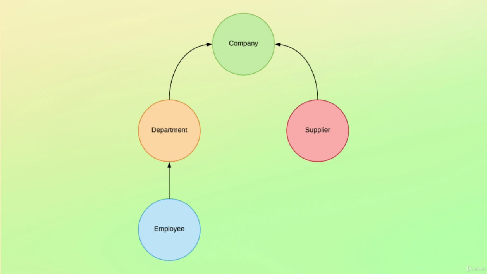

# Multi Level Relationship

Elasticsearch also supports multilevel relationships (Parent -> Children -> Granchildren)

Suppose the following example:



## Creating Index
```bash
PUT /company
{
  "mappings": {
    "properties": {
      "join_field": { 
        "type": "join",
        "relations": {
          # Defines Parent/Children Relationship
          "company": ["department", "supplier"],
          # Defines Children/Granchildren Relationship
          "department": "employee"
        }
      }
    }
  }
}
```

### Adding Documents

`Important` - All Children and Granchildren should be store in the same shard than their father, so the routing key will be always the company id that department/employees belong to.

```bash

PUT /company/_doc/1
{
  "name": "My Company Inc.",
  "join_field": "company"
}

PUT /company/_doc/2?routing=1
{
  "name": "Development",
  "join_field": {
    "name": "department",
    "parent": 1
  }
}

PUT /company/_doc/3?routing=1
{
  "name": "Bo Andersen",
  "join_field": {
    "name": "employee",
    "parent": 2
  }
}

PUT /company/_doc/4
{
  "name": "Another Company, Inc.",
  "join_field": "company"
}

PUT /company/_doc/5?routing=4
{
  "name": "Marketing",
  "join_field": {
    "name": "department",
    "parent": 4
  }
}

PUT /company/_doc/6?routing=4
{
  "name": "John Doe",
  "join_field": {
    "name": "employee",
    "parent": 5
  }
}
```

## Querying Documents
```bash
GET /company/_search
{
  "query": {
    "has_child": {
      "type": "department",
      "query": {
        "has_child": {
          "type": "employee",
          "query": {
            "term": {
              "name.keyword": "John Doe"
            }
          }
        }
      }
    }
  }
}
```