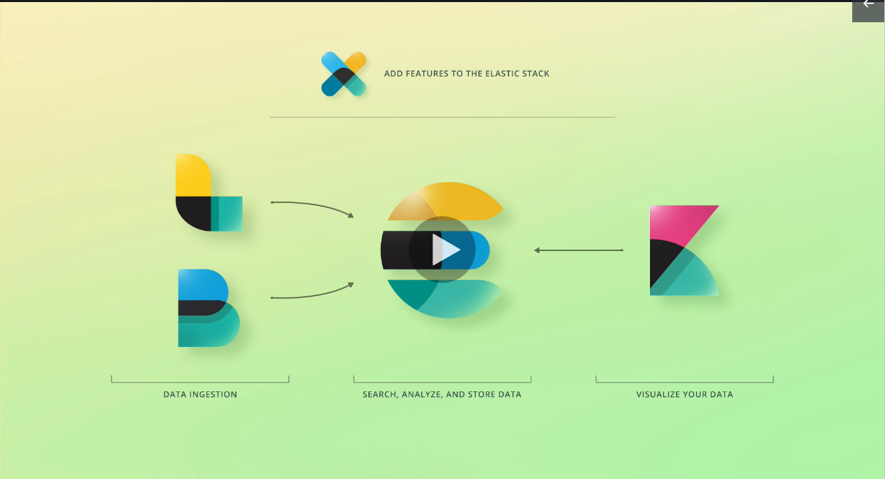

# Introduction

## Concepts

 - `documents` - data stored (Like Rows in a relational database)
 - `fields` - Document`s data is separated into fields (Like Columns in a relational database)

 ```javascript
 /* Example of Document */
 {
   "fistName": "Tiago",
   "lastName": "Missão",
   "interests": ["devops", "terraform", "elasticsearch", "cloud"]
 }
 ```

 ## Elastic Stack

 - `Kibana` - Analytics & Visualization Plataform
 - `Logstash` - Data Processing Pipeline (Inputs / Filters / Outputs)
 - `X-Pack` - Adds additional features to ES & Kibana (Authentication / Authorization / Monitoring / Alerting / Reporting / Machine Learning )
 - `Beats` - Collection of diferent types of lightweight agents that collect data and send to logstash or elasticsearch



 ## Utils

 - Kibana Demo - https://demo.elastic.co/app/dashboards