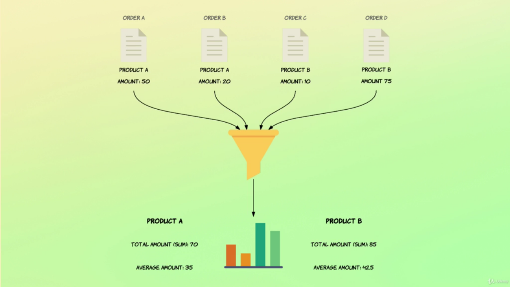
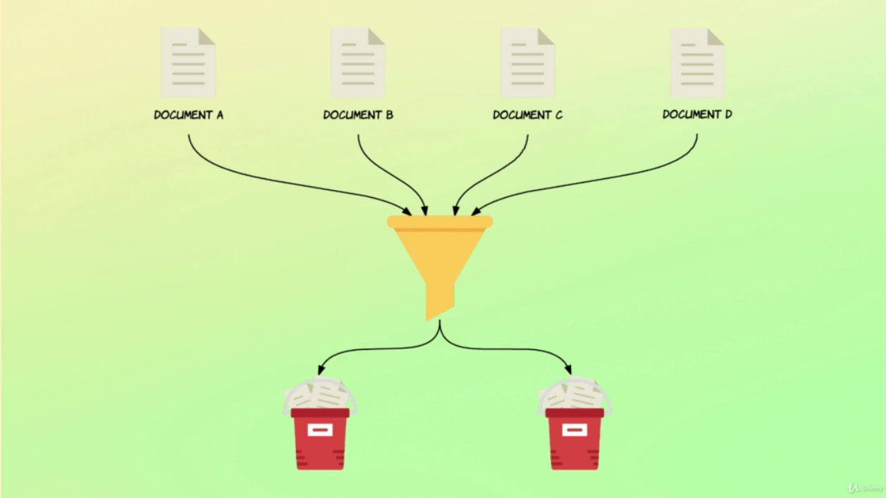
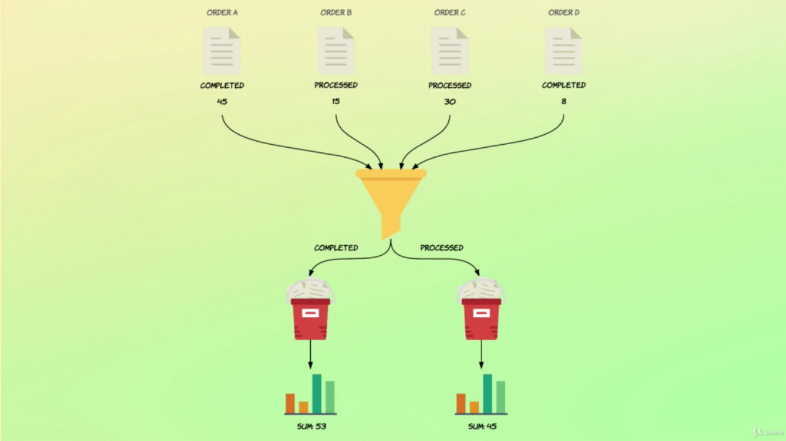
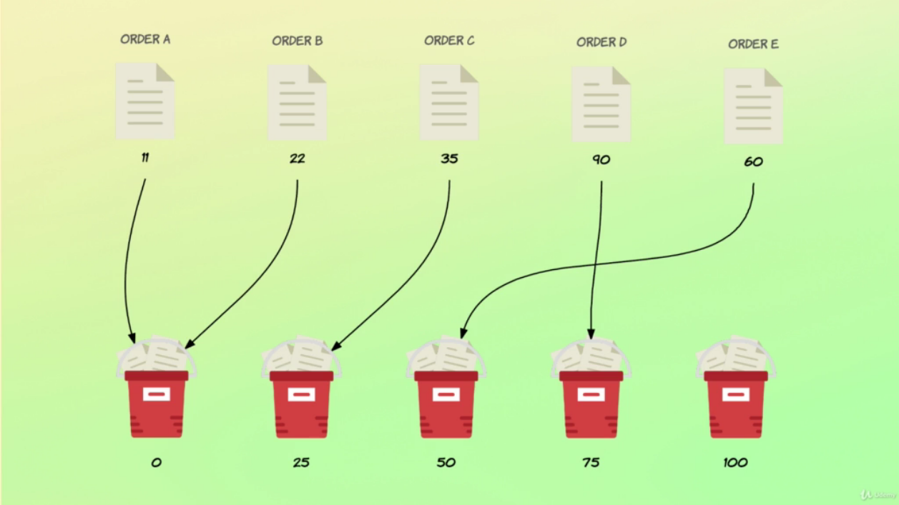

# Aggregations

Aggregations is a way to group, extract statistics and summaries from your data.



## Metric Aggregation
---

Metrics Aggregation are divided in two categories:

- `Single Value Numeric Metric Aggregations` - The result of all computed data is a single numeric value.
```bash
# GET /<index>/_search
# { "query": {...}, "aggs": { "aggregation-custom-name": { "<sum|avg|min|max>': { "field": "<field-path>" }}}}

GET /order/_search
{
  "size": 0, # We are not interested on the result set
  "query": {
    "match_all": {}
  }, 
  "aggs": { # Aggregation Field Statement
    "total_sales": {
      "sum": { # Sum Aggregation
        "field": "total_amount" # field of interest
      }
    },
    "avg_sale": {
      "avg": { # Avg Aggregation
        "field": "total_amount"
      }
    },
    "min_sale": {
      "min": { # Min Aggregation
        "field": "total_amount"
      }
    },
    "max_sale": {
      "max": { # Max Aggregation
        "field": "total_amount"
      }
    }
  }
}

GET /order/_search
{
  "size": 0,
  "aggs": {
    "total_salesman": {
      "cardinality": { # How Many Distinct Elements (Approximately)
        "field": "salesman.id"
      }
    },
    "values_count": {
      "value_count": { # Counts the number of values that the aggregation is based on.
        "field": "total_amount"
      }
    }
  }
}
```

- `Multi Value Numeric Metric Aggregations` - The result of all computed data are a group of values.

```bash
GET /order/_search
{
  "size": 0,
  "aggs": {
    # Return Multi Values based on `min`, `max`, `sum`, `count` and `avg` metrics.
    "amount_stats": {
      "stats": {
        "field": "total_amount"
      }
    }
  }
}
``` 
---

## Bucket Aggregations
---

Bucket Aggregations create buckets of documents, in other words, it groups documents



```bash
GET /order/_search
{
  "size": 0,
  "aggs": {
    "status_terms": {
      # Groups by terms
      "terms": {
        "field": "status",
        # Docs that does not have status values goes to "n/a" bucket
        "missing": "n/a",
        "min_doc_count": 0,
        "order": {
          "_key": "asc"
        }
      }
    }
  }
}
```

## Nested Aggregations
---

Nested aggregations allows to run aggregation inside other aggregation like `Buckets Aggregations`



- `Nested Aggrefation`

```bash
GET /order/_search
{
  "size": 0, 
  "query": {
    "range": {
      "total_amount": {
        "gte": 100
      }
    }
  },
  # This Aggretion runs on the context of the Query
  "aggs": {
    "status_terms": {
      "terms": {
        "field": "status"
      },
      # This Aggregation runs on the context of the bucket aggregation, so each bucket will have its own stats calculated
      "aggs": {
        "status_stats": {
          "stats": {
            "field": "total_amount"
          }
        }
      }
    }
  }
}

### Response

{
  "took": 3,
  ...
  "aggregations" : {
    "status_terms" : {
      "doc_count_error_upper_bound" : 0,
      "sum_other_doc_count" : 0,
      "buckets" : [
        {
          "key" : "pending",
          "doc_count" : 110,
          "status_stats" : {
            "count" : 110,
            "min" : 100.07,
            "max" : 260.03,
            "avg" : 159.29090909090908,
            "sum" : 17522.0
          }
        },
        {
          "key" : "completed",
          "doc_count" : 103,
          "status_stats" : {
            "count" : 103,
            "min" : 103.38,
            "max" : 260.59,
            "avg" : 162.43087378640777,
            "sum" : 16730.38
          }
        },
        {
          "key" : "processed",
          "doc_count" : 103,
          "status_stats" : {
            "count" : 103,
            "min" : 100.83,
            "max" : 281.77,
            "avg" : 155.7231067961165,
            "sum" : 16039.48
          }
        },
        {
          "key" : "cancelled",
          "doc_count" : 96,
          "status_stats" : {
            "count" : 96,
            "min" : 100.05,
            "max" : 272.9,
            "avg" : 152.56229166666665,
            "sum" : 14645.98
          }
        },
        {
          "key" : "confirmed",
          "doc_count" : 77,
          "status_stats" : {
            "count" : 77,
            "min" : 100.98,
            "max" : 246.89,
            "avg" : 155.78025974025974,
            "sum" : 11995.08
          }
        }
      ]
    }
  }

}

```

- `Filtering a Aggregation`

```bash
GET /order/_search
{
  "size": 0, 
  # This aggregation runs on the context of the query, so all documents are considered
  "aggs": {
    "low_value": {
      "filter": {
        "range": {
          "total_amount": {
            "lte": 50
          }
        }
      },
    # This aggregation runs on the context of the filter, so just values <= 50 are considered
      "aggs": {
        "avg_amount": {
          "avg": {
            "field": "total_amount"
          }
        }
      }
    }
  }
}
```

- `Filters Aggregations`

```bash
GET /recipe/_search
{
  "size": 0,
  "query": {"match_all": {}},
  "aggs": {
    "custom_filter": {
      # Define Rules for Buckets Aggregations
      "filters": {
        "filters": {
          "pasta": {
            "match": {
              "title": "pasta"
            }
          },
          "spaghetti": {
            "match": {
              "title": "spaghetti"
            }
          }
        }
      },
      "aggs": {
        "avg_ratting": {
          "avg": {
            "field": "ratings"
          }
        }
      }
    }
  }
}

# Results

{
  "took": 4,
  ...
  "aggregations" : {
    "custom_filter" : {
      "buckets" : {
        "pasta" : {
          "doc_count" : 9,
          "avg_ratting" : {
            "value" : 3.4125
          }
        },
        "spaghetti" : {
          "doc_count" : 4,
          "avg_ratting" : {
            "value" : 2.3684210526315788
          }
        }
      }
    }
  }

}
```

- `Ranges Aggregations`
```bash
GET /order/_search
{
  "size": 0
  , "aggs": {
    "amount_ranges": {
      "range": {
        "field": "total_amount",
        "ranges": [
          { "to": 50 },
          { "from": 50, "to": "100" },
          { "from": 100 }
        ]
      }
    }
  }
}
```

- `Date Range Aggregations`
```bash
GET /order/_search
{
  "size": 0,
  "aggs": {
    "purchased_ranges": {
      "date_range": {
        "field": "purchased_at",
        "format": "yyyy-MM-dd", 
        "keyed": true,
        "ranges": [
          {
            "from": "2016-01-01",
            "to": "2016-01-01||+6M",
            "key": "first_half"
          },
          {
            "from": "2016-01-01||+6M",
            "to": "2016-01-01||+1y",
            "key": "second_half"
          }
        ]
      },
      "aggs": {
        "total_amount_stats": {
          "stats": {
            "field": "total_amount"
          }
        }
      }
    }
  }
}
```


- `Histogram`

Elasticsearch automatically creates buckets based a fixed value.



```bash
GET /order/_search
{
  "size": 0,
  "query": {
    "range": {
      "total_amount": {
        "gte": 100
      }
    }  
  },
  "aggs": {
    "amount_distribution": {
      "histogram": {
        "field": "total_amount",
        "interval": 25,
        "min_doc_count": 0, 
        "extended_bounds": {
          "min": 0,
          "max": 500
        }
      }
    }
  }
}
```

- `Date Histogram`
```bash
GET /order/_search
{
  "size": 0,
  "aggs": {
    "order_over_time": {
      "date_histogram": {
        "field": "purchased_at",
        "interval": "month", 
        "format": "yyyy-MM-dd"
      }
    }
  }
}
```

- `Missing Aggregation`
```bash
GET /order/_search
{
  "size": 0,
  "aggs": {
    "order_without_status": {
      "missing": {
        "field": "status"
      },
      "aggs": {
        "missing_sum": {
          "sum": {
            "field": "total_amount"
          }
        }
      }
    }
  }
}
```

- `Nested Aggregation`
```bash
GET /department/_search
{
  "size": 0,
  "aggs": {
    "employees": {
      "nested": {
        "path": "employees"
      }, 
      "aggs": {
        "minimum_age": {
          "min": {
            "field": "employees.age"
          }
        }
      }
    }
  }
}
```

## Global Aggregation
---
Breaks out the query context, to interate over all elements

```bash
GET /order/_search
{
  "size": 0,
  "query": {
    "range": {
      "total_amount": {
        "gte": 100
      }
    }
  },
  "aggs": {
    "all_orders": {
      "global": {},
      "aggs": {
        "stats_amount": {
          "stats": {
            "field": "total_amount"
          }
        }
      }
    },
    "stats_expensive": {
      "stats": {
        "field": "total_amount"
      }
    }
  }
}

# Results

{
  "took": 4,
  ...
  "aggregations" : {
    "all_orders" : {
      "doc_count" : 1000,
      "stats_amount" : {
        "count" : 1000,
        "min" : 10.27,
        "max" : 281.77,
        "avg" : 109.20961,
        "sum" : 109209.61
      }
    },
    "stats_expensive" : {
      "count" : 489,
      "min" : 100.05,
      "max" : 281.77,
      "avg" : 157.32703476482618,
      "sum" : 76932.92
    }
  }
}
```

## Utils
---

- [Metrics Aggregations](https://www.elastic.co/guide/en/elasticsearch/reference/current/search-aggregations-metrics.html)

- [Bucket Aggregations](https://www.elastic.co/guide/en/elasticsearch/reference/current/search-aggregations-bucket.html)