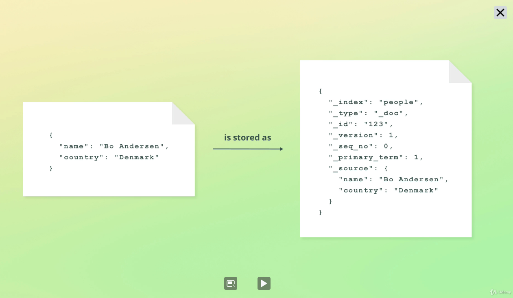
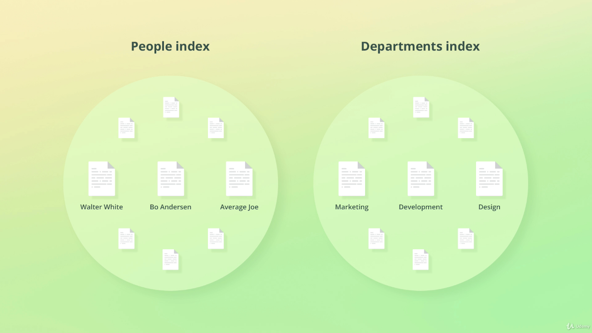
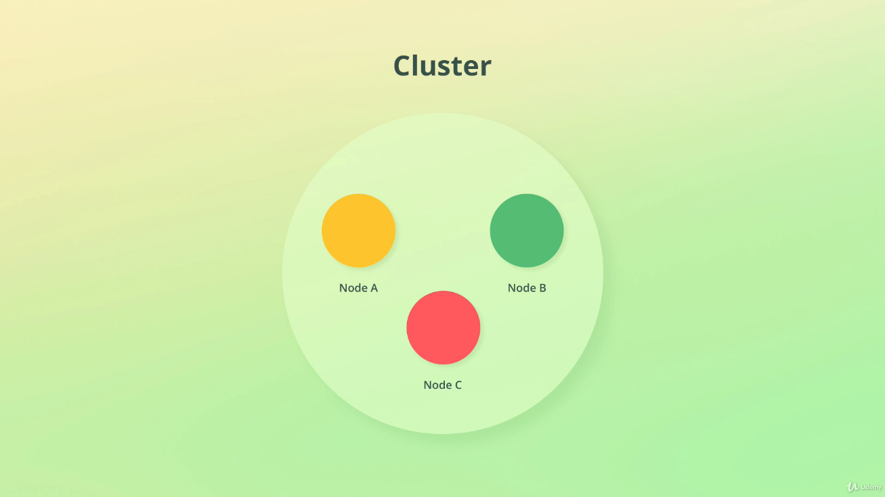
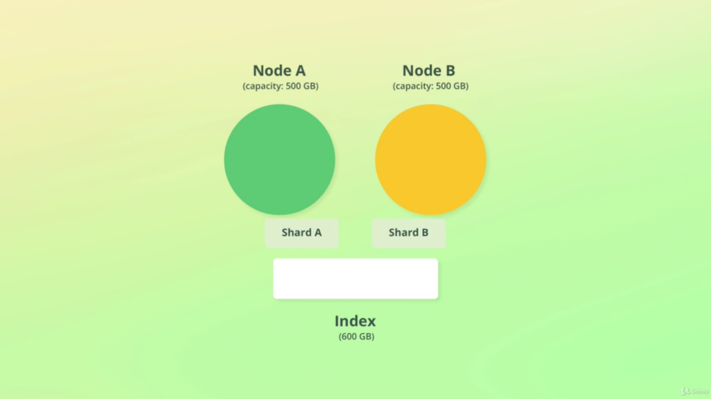
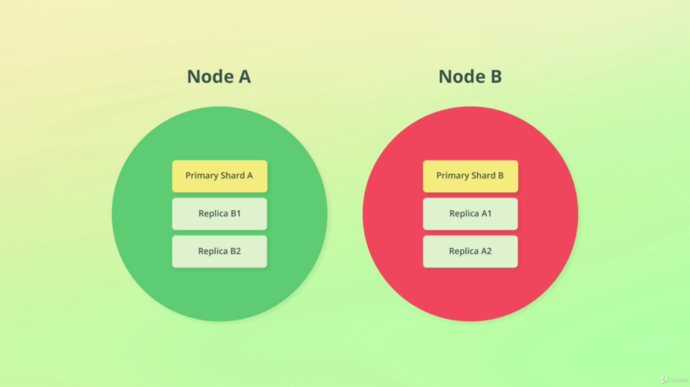
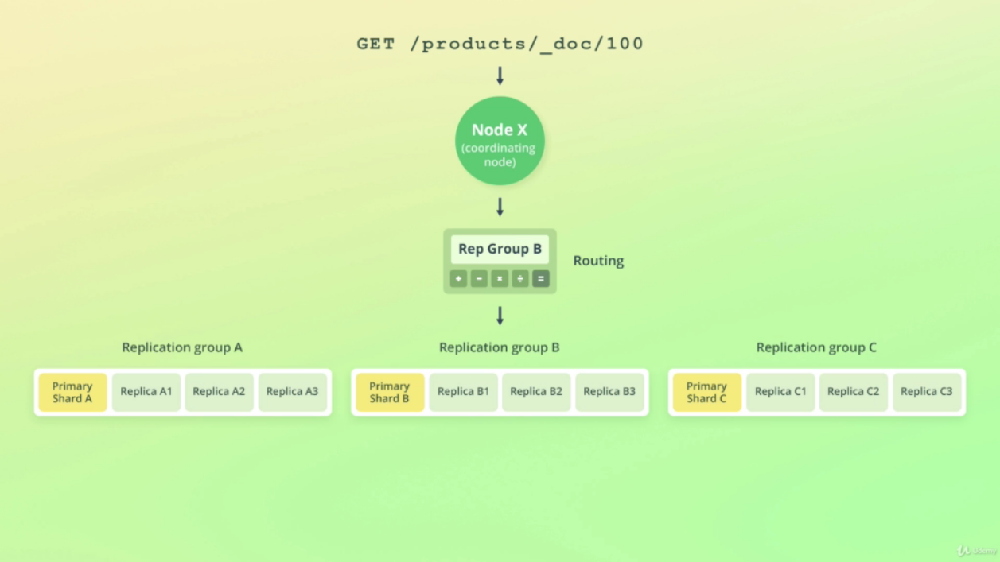

# GettingStarted

## Installing ElasticSearch
---

- `Running as a Service` - https://info.elastic.co/elasticsearch-service-trial-course.html
- `Docker` - https://www.elastic.co/guide/en/elasticsearch/reference/current/docker.html

## Architecture
---

`Document` - Data stored in a index representing a unit of information, also contains metadata that is used internally by ES



`Index` -  Collection of documents, groups documents logically



`Node` - Instance of ElasticSearch that stores data, and each node can store just a part of the data. A node will be always part of a cluster. So at starting the node will join a cluster or create a new one.

`Cluster` - Collection of related nodes, can have one or more nodes.



## ElasticSearch API
---
Allows to run commands on ElasticSearch using Rest API

### `Kibana`
[`VERB`] /[`API`]/[`COMMAND`]
```bash
# <VERB> /<API>/<COMMAND>
GET /_cluster/health
```

### `cURL`
curl -XGET -u authentication "`<endpoint>`/`<api>`/`<command>`"
```bash
curl -XGET -u elastic:xpto1325196 "https://missaostudies.es.us-west1.gcp.cloud.es.io:9243/_cluster/health"
```


## Inspect Cluster
---

- Cluster Health
```
GET /_cluster/health
```

- Nodes Informations
```
GET /_cat/nodes?v
```

- List Indeces
```
GET /_cat/indeces?v
```

## Sharding
---
A way to divide indices into smaller pieces, so each piece is a shard, allowing horizontal scalling volume. The default number os shardes in `1`.

Sharding is done at index level. 

A Shard can store up to 2 billion documents.

Shard allows queries to run in parallel, increasing the throughput of an index.



`Spli API` allows to increase the number of shards in a index (involves create a new index)

`Shrink API` allows to decrease the number of shards in a index (involves create a new index)

- List Shards
```
GET /_cat/shards?v
```

## Replication
---
Allows fault toleration replicating data (shards) across cluster nodes (replica shards).

Replication is configured at the index level. Defaults is `1`.

- `Primary Shard` - Shard that has been replicated.
- `Replica Shard` - Copy of a Shard that can be used to serve search requests (Increase Throughput).
- `Replication Group` - Primary Shards + Replica Shards.



## Routing
---
Elastic uses a formula (routing) to define where the document will be stored. Normally the `_routing` value is the document`s ID
Ex:
```
shard_num = hash(_routing) % num_primary_shards
```

The default routing strategy ensure that the documents are distributed evenly across shards.


## Snapshot
---

Elasticsearch supports taking snapshots as backups, allowing to restore to a given point in time. And you can snapshot:

- `Index`
- `Entire Cluster`

## Node Roles
---
Each node can have one or more roles, defining for what the node is elegible to.

- `master` - responsible to perform cluster wide actions (create / deleting indices).

- `data` - enables node to store data, performing search queries and modifications.

- `ingest` - enables node to ingest (adding documents to a index) data pipelines.

- `ml` - identifies node as a machine learning node.

- `coordination` - coordinates the distribution of queries and the aggregation among the cluster. This is archieve by disable all other roles. (Usefull for large cluster) 
```
node.master: false
node.data: false
node.ingest: false
node.ml: false
xpack.ml.enabled: false
```

## Utils
---

- `cat` - https://www.elastic.co/guide/en/elasticsearch/reference/current/cat.html

- `cat nodes API` - https://www.elastic.co/guide/en/elasticsearch/reference/current/cat-nodes.html

- `cat nodes info API` - https://www.elastic.co/guide/en/elasticsearch/reference/current/cluster-nodes-info.html

- `auto_expand_replicas` - Property on index level that allow to expand the number of replicas based on the number of nodes in cluster.