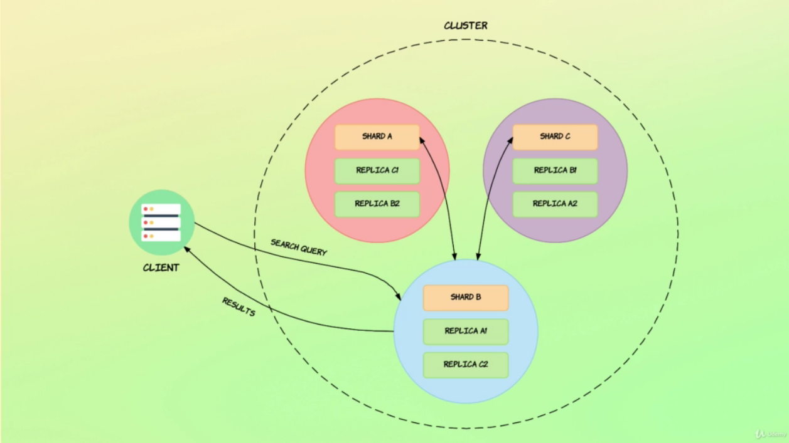
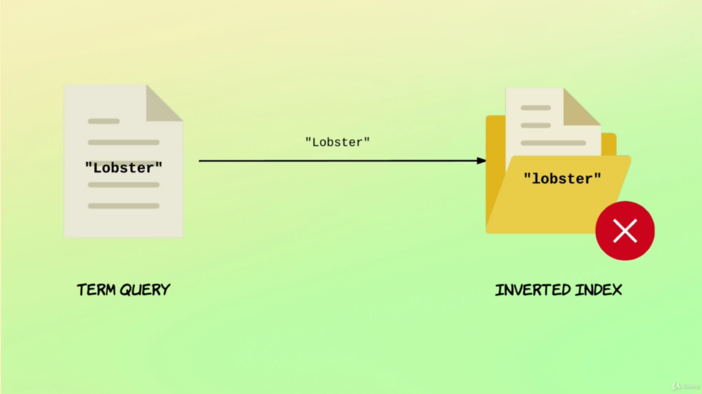
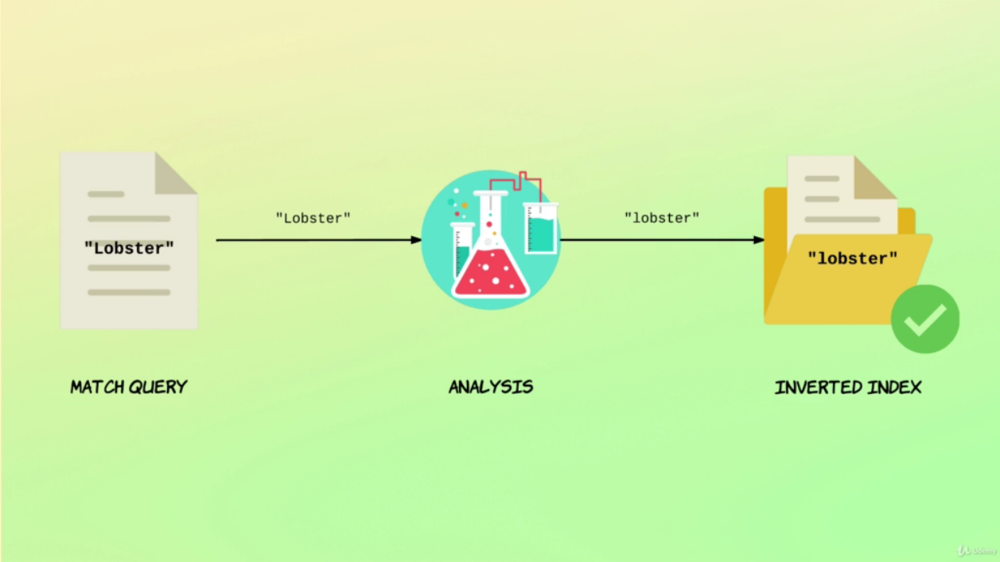

# Introduction to Search

On Elastic it is possible to search documents using two methods.

- `Query String` - Quick way, but limited
```bash
# GET /<index>/_search?q=<query-params>
GET /products/_search?q=name:pasta
```

- `Query DSL` - The most flexible and common way, writing query on request body
```bash
# GET /<index>/_search
# { "query": <query json> }

GET /products/_search
{
  "query": {
    "match": {
      "description": {
        "query": "red wine"
      }
    }
  }
}

# Or Better Compact Way
GET /products/_search
{
  "query": {
    "match": {
      "description": "red wine"
    }
  }
}
```

## How Search Works
---
This is how search operations run on elasticsearch cluster.

1. Client sends a request to cluster
2. The Coordinator Node receives the request and broadcast it to the other nodes
3. The search is performed on each node in the right shard (primary or replica).
4. Nodes reply to the Coordinator Node
5. The Coordinator Node merges all the responses and answer the request



## How Relevance Score is Computed
---
To calculate the score relevance of a search, elasticsearch uses statistics algorithms. In the past **TF/IDF(Term Frequency/Inverse Document Frequency)** but now it uses **Okapi BM25** which is a better implementation of TF/IDF dealing with *stop words*. So, this factors are take in place:

- `Term Frequency` - How many times does the terme appear in the field for a given document. (More times, more Relevance)

- `Inverse Document Frequency` - How often does the term appear within the index, accross all documents ( If the terms appers often than lower is the relevance ).

- `Field-length norm` - How long is the field ( If the field is bigger than less is the relevance )

For check how relevance score is calculate in a search uses this option:

```bash
# GET /<index>/_search
# {"explain": true, "query": "...."}

GET /products/_search
{
  "explain": true,
  "query": {
    "match": {
      "name": {
        "query": "pasta"
      }
    }
  }
}
```

## Troubleshooting Searches
---

The best way to troubleshooting the results of a searches (why it matches or why it does not match) is using the **Explain API**

```bash
# GET /<index>/_explain/<docId>
# { "query": { ... } }

GET /products/_explain/1
{
  "query": {
    "term": {
      "name": "wine"
    }
  }
}
```

## Query Contexts
---
When searching on elasticsearch it is possible to perform 2 types of queries:

- `Query Context` - "How Well Do Documents Match ?" (Calculates Relevance Score)

- `Filter Context` - "Do Documents Match ?" (Filters documents not calculating their relevance score)

## Query Groups
---
Elasticsearh have two types of queries:

- `Term Query` - Searches for exact values, exact matches. No analyzer is used.



- `Match Query` - Before searches in index, the input is analyzed, and after that the result is researched in the index.




## Utils
---

- [Query String Query](https://www.elastic.co/guide/en/elasticsearch/reference/current/query-dsl-query-string-query.html)

- [Match All](https://www.elastic.co/guide/en/elasticsearch/reference/current/query-dsl-match-all-query.html)

- [Explain API](https://www.elastic.co/guide/en/elasticsearch/reference/current/search-explain.html)
