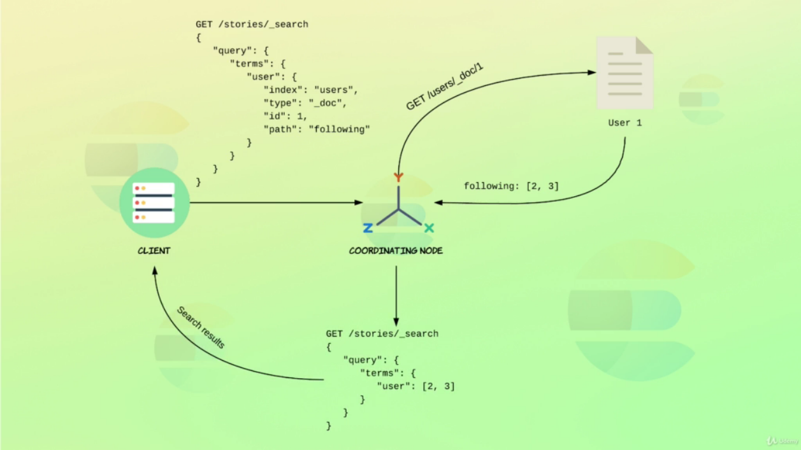

# Terms Lookup Mechanism

Terms Lookup Mechanism is a way that elasticsearch allows to use documents themselves as the list of Terms, avoinding unnecessary requests.

Supposed the following indeces:

 ```bash
 # Users
PUT /users/_doc/1
{
  "name": "John Roberts",
  "following" : [2, 3]
}

PUT /users/_doc/2
{
  "name": "Elizabeth Ross",
  "following" : []
}

PUT /users/_doc/3
{
  "name": "Jeremy Brooks",
  "following" : [1, 2]
}

PUT /users/_doc/4
{
  "name": "Diana Moore",
  "following" : [3, 1]
}

# Stories
PUT /stories/_doc/1
{
  "user": 3,
  "content": "Wow look, a penguin!"
}

PUT /stories/_doc/2
{
  "user": 1,
  "content": "Just another day at the office... #coffee"
}

PUT /stories/_doc/3
{
  "user": 1,
  "content": "Making search great again! #elasticsearch #elk"
}

PUT /stories/_doc/4
{
  "user": 4,
  "content": "Had a blast today! #rollercoaster #amusementpark"
}

PUT /stories/_doc/5
{
  "user": 4,
  "content": "Yay, I just got hired as an Elasticsearch consultant - so excited!"
}

PUT /stories/_doc/6
{
  "user": 2,
  "content": "Chilling at the beach @ Greece #vacation #goodtimes"
}

 ```

 Now, a logged user ( User 1 ) wanna see all his stories, in other words, all the stories of their friends. So, it is necessaryL

 1. Locate Who User 1 is following
 2. Locate all stories from Who User 1 is following

- `Lookup Query`

 ```bash
 GET /stories/_search
{
  "query": {
    "terms": {
      "user": {
        # Users the _doc/1 with field `following` as input for terms in the search
        "index": "users",
        "id": "1",
        "path": "following"
      }
    }
  }
}
 ```

  

  ## Utils
---

- [LookupMechanism](https://www.elastic.co/blog/terms-filter-lookup)