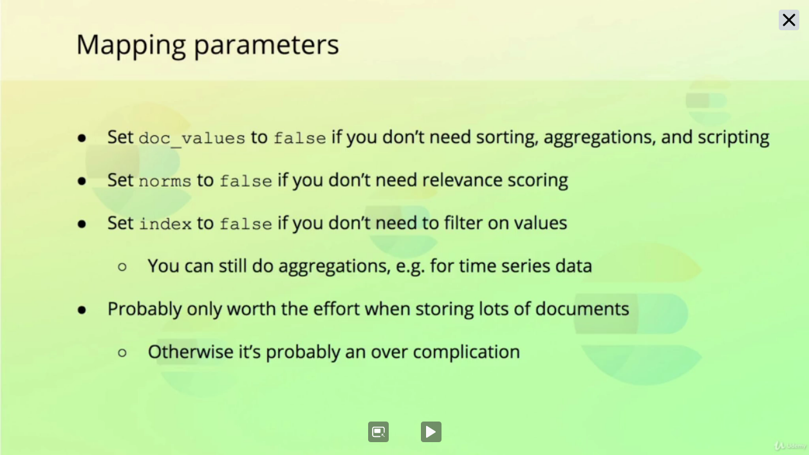

# Recommendations

On production it is a good idea to following these guidelines:

- `Use Explicit Mappings`
```bash
PUT /index
{
  "mappings": {
    # Avoids to add fields that does not have mappings and avoid unexpected search results, since it will not be indexed
    "dynamic": "strict"
    ...
  }
}
```

- `Not Mappings Text Fields to text and keyword at same time`

Usually just one time is needed, so doing that it is possible to save disk space and increase throughput.

- `Disable Coercion`
```bash
PUT /index
{
  "settings": {
    "index.mapping.coerce": false
  }
  "mappings": {
    ...
  }
}
```

- `Use the correct numeric data types`

The long type can store bigger number however usually the integer type already is more than enough. The same case applies on double and float.

- `Mapping Parameters`

